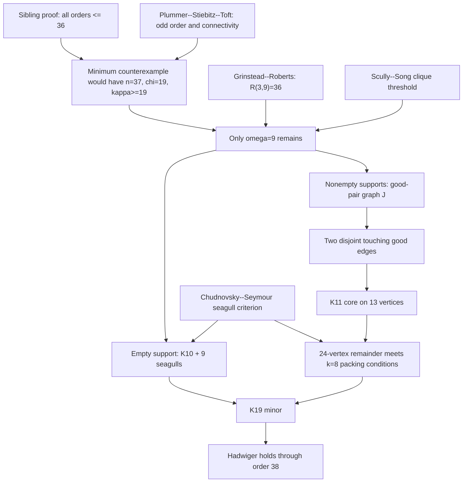

# Proof dependency graph

The new argument consists of the support counts and component/Hall
argument at `J` and `MATCH`, plus the elementary verification of the
packing hypotheses at `EMPTY` and `REM`. External or sibling trust
boundaries are:

- the minimum-counterexample reduction of Plummer--Stiebitz--Toft;
- the exact Ramsey value \(R(3,9)=36\);
- Scully--Song's dominating-minor clique threshold;
- Chudnovsky--Seymour's seagull-packing theorem;
- the sibling proof through order 36.
